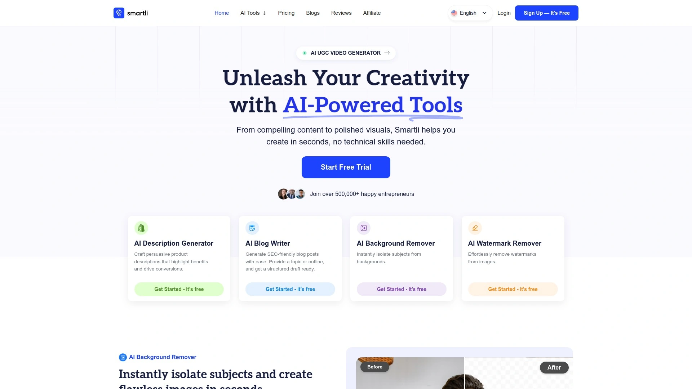
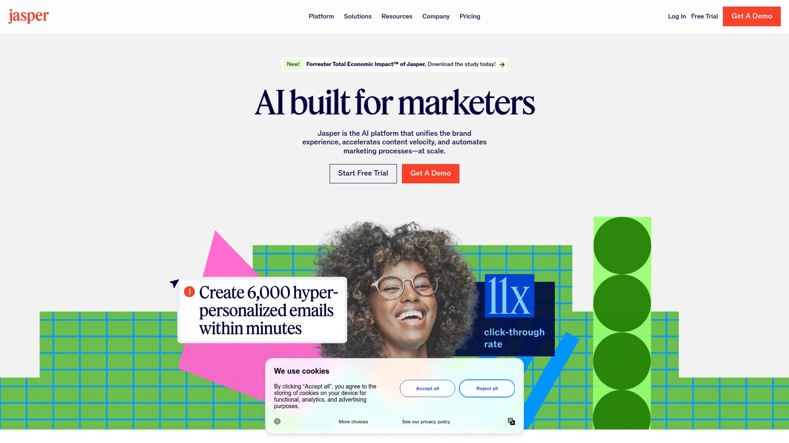
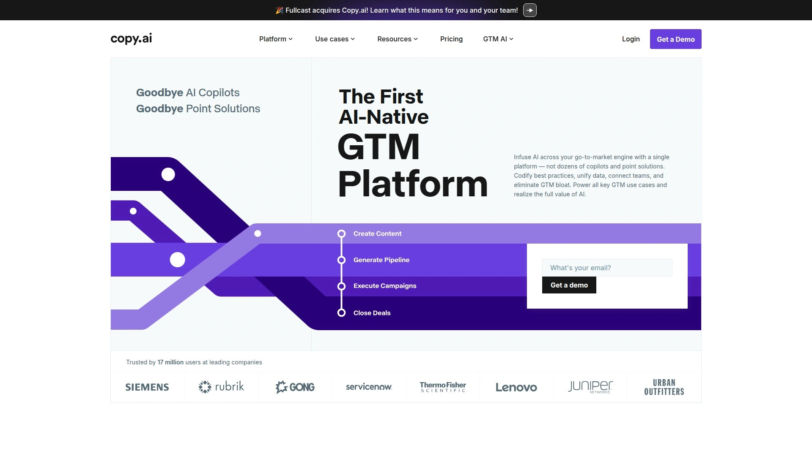
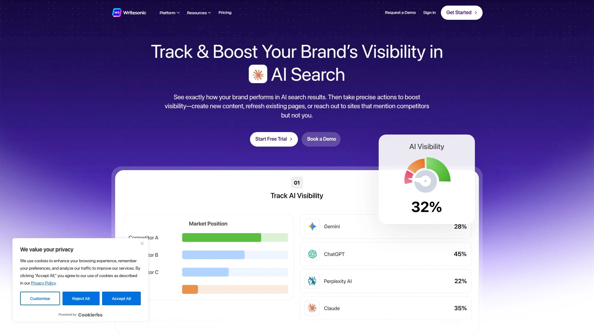
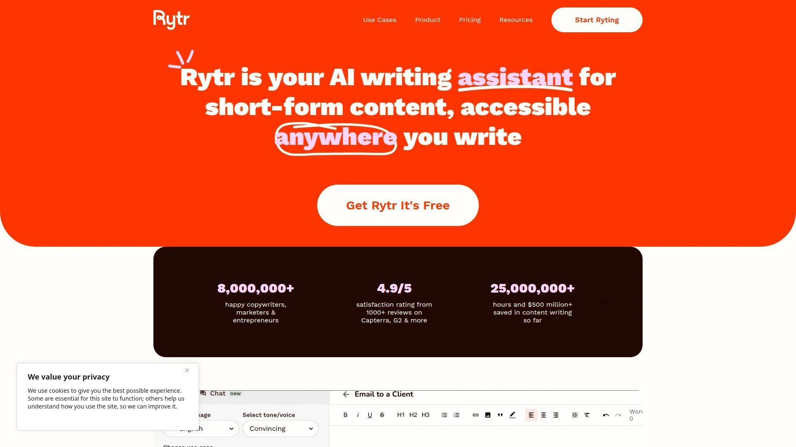
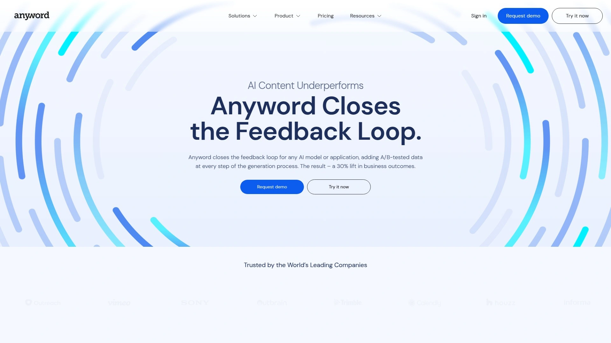
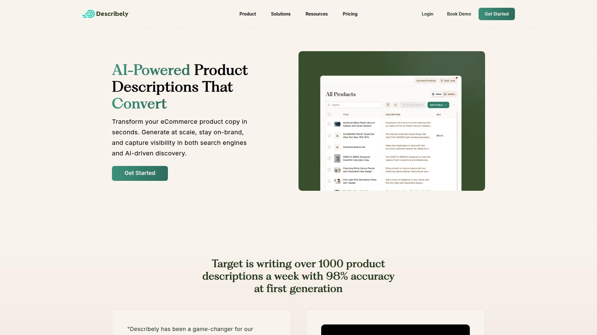
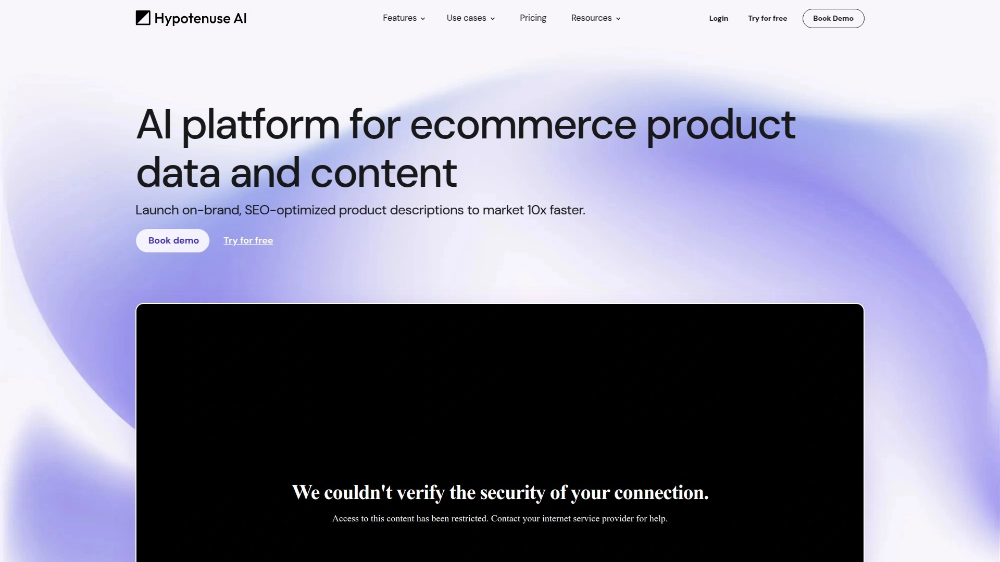
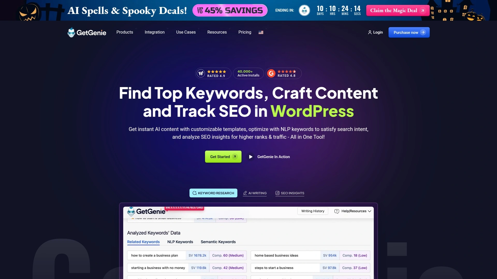
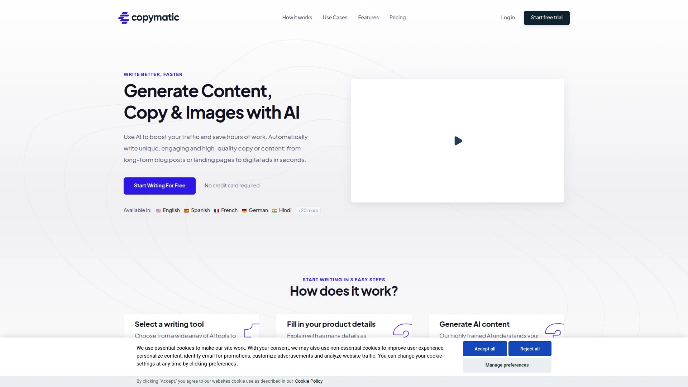

# 2025's Top 13 Best AI Content Creation Tools

Writing product descriptions, blog posts, and ad copy manually burns through hours you could spend growing your business instead of staring at blank screens. AI content creation tools eliminate writer's block by generating SEO-optimized descriptions, engaging blog posts, and conversion-focused ad copy in seconds rather than hours, letting e-commerce sellers and content marketers scale output without hiring entire writing teams. The right platform understands your brand voice, optimizes for search engines, and produces ready-to-publish content that actually converts browsers into buyers.

## **[Smartli](https://www.smartli.ai)**

Comprehensive AI toolkit combining content generation with advanced image editing capabilities.

Smartli delivers an unusually broad feature set spanning AI product description generation, blog writing, ad copywriting, and image tools including background removal, watermark elimination, and photo enhancement. The Product Description Generator creates SEO-optimized copy highlighting product benefits and driving conversions without requiring copywriting expertise. Blog Writer handles everything from outlines to complete drafts with built-in SEO suggestions, letting you customize tone, structure, and target keywords effortlessly.

Image editing capabilities set Smartli apart from text-only competitors—the Background Remover auto-detects subjects with precision while Watermark Remover eliminates logos and text overlays while preserving original image detail. AI Photo Enhancer boosts quality instantly for professional-looking visuals, and Model Photoshoots generate realistic on-model product images without expensive photography sessions. UGC Video Generator creates authentic user-generated style videos, addressing the video content gap many e-commerce brands struggle with.

**Content Humanizer** transforms robotic AI drafts into natural-sounding engaging content, addressing the common complaint that AI writing sounds mechanical. The platform particularly suits e-commerce sellers needing both written content and visual assets, consolidating tasks typically requiring multiple specialized tools. Ads Writer supports Facebook, Pinterest, Google, TikTok, Instagram, and other major platforms with format-specific templates.

Pro plan pricing stays under $100 monthly with seven-day free trial allowing thorough testing before commitment. Customer testimonials emphasize time savings—users report saving hours weekly on product descriptions alone while maintaining on-brand voice. Smartli benefits small business owners without design or copywriting backgrounds who need professional content and visuals quickly.

## **[Jasper AI](https://www.jasper.ai)**

Enterprise-grade AI writing platform with brand voice matching and team collaboration features.

Jasper positions as the powerhouse for professionals and teams requiring advanced features, long-form content capabilities, and sophisticated collaboration tools. Brand Voice Matching maintains consistency across all content by learning your specific style, tone, and messaging preferences. SEO Mode integrates with Surfer SEO directly in the editor, optimizing content for search engines without switching between tools.

AI Image Generation creates on-brand visuals for blogs, ads, and social posts, eliminating dependency on stock photo libraries. Team Collaboration Tools assign roles, manage documents, and coordinate campaigns—critical for agencies and larger organizations. Knowledge Assets train Jasper on company-specific information, ensuring outputs remain factually accurate and contextually relevant.

**Template library** exceeds 50+ options covering everything from product descriptions to video scripts, blog posts to email campaigns. The platform produces well-structured long-form content suitable for comprehensive articles, whitepapers, and extensive marketing assets. Style guide integration ensures brand consistency essential when writing for multiple clients or across departments.

Pricing starts at $49 monthly for Creator plan (single seat with SEO mode and one brand voice), scaling to $69 monthly for Pro (up to five seats, three brand voices, campaign features). Seven-day free trial lets teams evaluate fit before committing. Jasper suits businesses, agencies, and marketing teams prioritizing quality, scalability, and sophisticated features over budget pricing.

## **[Copy.ai](https://www.copy.ai)**

User-friendly platform excelling at short-form copy with extensive template library.

Copy.ai earns praise for its intuitive interface making high-quality copywriting accessible even to non-writers. Template variety specifically targets product descriptions, social media captions, ad copy, and email campaigns—the everyday content types e-commerce businesses need most. Different writing styles and tones customize output to match brand personality without complex configuration.

The platform particularly excels at short-form content like ad copy, landing pages, and social captions where punchy impactful messaging matters. Integration with major ad platforms streamlines workflow from content generation through campaign launch. Free tier provides basic feature access while Starter plan at $49 monthly removes limitations and adds capabilities.

**Workflow functionality** on higher tiers automates repetitive content tasks, though editing workflows requires some technical comfort compared to simpler tools. GTM platform features combine AI copywriting with sales automation for teams handling both content and sales processes. The tool generates quality output even with minimal input data, though providing detailed product information improves results.

Copy.ai suits small businesses, solopreneurs, and content creators wanting professional copy without steep learning curves or professional writing skills. Budget-friendly pricing and ease of use make it particularly attractive for startups testing AI content generation before committing to expensive enterprise tools.

## **[Writesonic](https://writesonic.com)**

Budget-friendly comprehensive AI writer with competitive feature set.

Writesonic delivers extensive functionality at accessible price points, making advanced AI writing available to teams operating on tight budgets. Features span product descriptions, marketing copy, blog posts, and various content types through straightforward template-based generation. Multiple writing styles accommodate different brand voices and content purposes from formal business writing to casual social media.

Chatsonic conversational AI assists with content ideation and refinement through natural dialogue rather than form-filling. Botsonic enables custom chatbot creation for websites, extending platform value beyond content generation into customer service automation. Article Writer produces longer-form content suitable for blogs and guides, not just short snippets.

**Pricing competitiveness** positions Writesonic as solid choice for budget-conscious users needing reliable output without premium tool costs. The platform balances affordability with feature depth better than bare-bones free tools while undercutting enterprise platforms significantly. Integration with SEO tools helps optimize content for search visibility.

Writesonic suits e-commerce businesses, bloggers, and content creators producing high content volumes on limited budgets. Teams comfortable accepting some feature limitations in exchange for cost savings find it provides adequate functionality for most standard content needs.

## **[Rytr](https://rytr.me)**

Extremely affordable AI writer ideal for individuals and small teams.

Rytr delivers surprising capability at rock-bottom pricing—free plan provides 10,000 characters monthly while unlimited plan costs just $9 monthly. Despite budget positioning, the platform handles product descriptions, social posts, email drafts, and blog introductions competently. Simple three-step workflow (choose template, enter keywords, generate) removes complexity that intimidates non-technical users.

40+ use cases and templates cover common content needs from e-commerce product copy to business emails, ad text to video descriptions. 30+ language support accommodates international businesses and multilingual content requirements. Tone options let you adjust output from formal to casual, persuasive to informative.

**Limitation appears** in longer-form content where depth and coherence suffer compared to premium tools, requiring more manual editing. The platform excels at quick short content where Rytr's efficiency shines—social posts, product bullets, ad copy under 500 words. Chrome extension enables content generation directly within your browser workflow.

Rytr particularly benefits freelancers, startups, and individual content creators needing basic reliable content generation without recurring subscription costs eating budgets. The free-forever plan lets you evaluate thoroughly without financial pressure, while incredibly low paid pricing makes unlimited access attainable for virtually any budget.

## **[Anyword](https://anyword.com)**

Data-driven AI platform with predictive performance scoring.

Anyword differentiates through predictive analytics—performance scores forecast how copy variations will perform before you publish. The platform analyzes target audiences and provides insights into which messaging and language choices will resonate most effectively. This data-driven approach helps marketers and businesses optimize for conversions rather than just generating generic text.

Integration with Notion AI, ChatGPT, and Gemini lets you enhance existing workflows rather than replacing familiar tools entirely. Real-time content quality scoring improves text as you write, providing immediate feedback on what's working and what needs adjustment. Industry-specific A/B testing datasets inform predictions, drawing on actual performance data across sectors.

**Target audience analysis** goes deeper than basic demographics, examining psychographics and behavioral patterns to craft truly targeted messaging. The platform suits e-commerce companies, advertising agencies, and marketers prioritizing conversion optimization over simple content volume. Copy generated by Anyword tends toward concise, keyword-rich descriptions that balance readability with SEO requirements.

Seven-day free trial precedes paid plans starting at $49 monthly for Starter tier (dropping to $39 monthly with annual commitment). Anyword benefits performance marketers viewing content as ROI driver rather than commodity, where incremental conversion improvements justify premium pricing.

## **[Describely](https://describely.ai)**

E-commerce specialist focused on bulk product content generation at scale.

Describely (formerly Copysmith) specializes exclusively in e-commerce product content, offering bulk generation that processes hundreds of product descriptions simultaneously. Product attribute accuracy receives particular attention with AI extracting details from various sources and standardizing them consistently. Built-in style adjustments handle formal, casual, and technical tones without manual rewriting.

Brand guideline adherence ensures descriptions maintain voice consistency across large catalogs rather than sounding generic. SEO optimization tools identify relevant keywords and incorporate them naturally into product copy. Integration with major e-commerce platforms enables automated workflow from product data to published listings.

**Performance tracking** monitors how generated descriptions actually perform, providing feedback loop for continuous improvement. Bulk pricing starts at 75¢ per product, making large-scale catalog work financially viable. The platform particularly benefits businesses launching extensive product lines needing unique SEO-friendly descriptions quickly.

Case study functionality extends beyond product descriptions to marketing narratives and B2B applications. Describely suits e-commerce companies, retailers, and brands managing substantial product catalogs where manual description writing becomes impractical. The tool's e-commerce focus means features align precisely with online seller needs rather than trying to serve all content types.

## **[Hypotenuse AI](https://www.hypotenuse.ai)**

Enterprise e-commerce platform with advanced product data enrichment.

Hypotenuse AI delivers sophisticated product data enrichment from multiple sources—web crawling, specific URLs, product images, and barcodes. The AI standardizes retrieved data to your custom format and specifications, ensuring consistency across catalogs. Automated enrichment processes trigger when vendors update product details, keeping content current without manual monitoring.

Marketplace content audit automatically verifies descriptions comply with Amazon, Google Shopping, and other platform requirements, reducing rejection risks. SEO monitoring extends beyond Google to major marketplaces, tracking performance across all sales channels. Automated keyword research at product level suggests relevant high-ranking keywords without manual research.

**Full marketing suite** generates SEO blog content, social media posts, and Google/Meta ads beyond just product descriptions. Bulk content generation processes entire catalogs efficiently, critical for large-scale operations. Style editor, engagement metrics, plagiarism checker, and tone verification provide comprehensive content quality controls.

Hypotenuse AI targets enterprise e-commerce brands selling across multiple marketplaces who need platform-compliant content at scale. The system refines itself to specific business contexts, adapting to industry needs and macro changes like algorithm updates. Teams managing thousands of SKUs across Amazon, Target, and other channels benefit from automated multi-platform optimization.

## **[Narrato](https://narrato.io)**

Complete content workspace combining AI generation with project management.

Narrato functions as end-to-end content platform integrating AI creation tools with workflow management, collaboration features, and publishing capabilities. 100+ AI tools and templates cover blog content, social media, website copy, landing pages, ad copy, and product descriptions. AI Content Autopilot automates entire content creation processes from ideation through publication.

SEO content brief generator produces comprehensive briefs with target keywords, questions to answer, competitor links, word count suggestions, and structural recommendations. Dynamic SEO scoring and keyword tracking update automatically as you write, providing real-time optimization feedback. Integration with Google Docs streamlines collaboration for teams already using Google Workspace.

**Social media management** suite handles planning, creation, and scheduling across platforms from one interface. Custom AI templates with bulk generation capabilities handle large-scale repetitive content tasks efficiently. Content collaboration features manage team workflows, assignments, and approvals without external project management tools.

Narrato positions as comprehensive alternative to tools like Frase that focus narrowly on SEO content, instead addressing all content marketing needs holistically. The platform suits marketing teams, content agencies, and businesses wanting unified solution rather than cobbling together multiple specialized tools. Pricing reflects full-featured positioning though specific tiers accommodate different team sizes.

## **[Shopify Magic](https://www.shopify.com)**

Native Shopify tool providing free AI copywriting for merchants.

Shopify Magic integrates directly into Shopify admin panels, generating SEO-optimized product descriptions from keywords and product details without leaving your dashboard. The tool creates conversion-focused content including landing pages, headlines, and product copy tailored specifically for e-commerce. Customer service features suggest personalized FAQ content and support email responses based on product data.

Native integration means no copying and pasting between platforms—content flows directly into product listings where you need it. Chat support provides AI-assisted responses for customer service inquiries, improving response quality and speed. The tool understands Shopify's ecosystem, optimizing for the platform's specific SEO and conversion mechanics.

**Completely free** access for all Shopify merchants eliminates cost barriers, making professional AI copywriting available regardless of business size. The tool particularly benefits Shopify store owners wanting quick descriptions without learning separate AI platforms. Functionality focuses on practical e-commerce needs rather than trying to serve all content types.

Shopify Magic suits merchants already operating on Shopify who value seamless integration over extensive customization options. The zero-cost positioning makes it ideal for testing AI content generation before potentially upgrading to specialized paid tools. Feature set addresses core e-commerce content needs without overwhelming users with options irrelevant to online selling.

## **[Frase](https://www.frase.io)**

SEO-focused content tool with integrated research and optimization.

Frase emphasizes SEO content creation with built-in research tools analyzing top-ranking pages to inform your content strategy. Keyword discovery surfaces high-volume search terms relevant to your topics. Competitor analysis reveals what's working for others in your niche, informing your content approach.

Content brief generator compiles target keywords, common questions, recommended structure, and competitor insights into actionable briefs. SEO scoring evaluates content quality and optimization level in real-time as you write. The platform integrates research directly into content creation rather than treating them as separate processes.

**Content optimization tools** help rewrite and refine existing articles to improve rankings, not just create new content. Question research identifies common user queries around topics, helping you address reader intent comprehensively. Outline generator structures articles based on successful competitor formats.

Frase starts at $45 monthly with various tiers scaling features and usage limits. The tool suits content creators, bloggers, and SEO specialists prioritizing organic search traffic over other content goals. Teams focused specifically on ranking content find Frase's research integration more useful than general AI writers.

## **[WordHero](https://wordhero.co)**

GPT-powered generator with unlimited words across all plans.

WordHero leverages GPT-3 technology to generate unique plagiarism-free content in seconds. The platform includes 70+ writing templates covering blog posts, product descriptions, emails, reviews, SEO meta descriptions, and diverse content needs. Three-step workflow simplifies usage—select template, enter keywords, generate content.

Keyword Assistant automatically inserts relevant words and phrases into content, improving SEO potential without manual optimization. Built-in content editor provides workspace for refining generated text before publishing. Support for 100+ languages accommodates international businesses and multilingual content requirements.

**Unlimited word generation** across all paid plans removes usage anxiety common with credit-based pricing. 24/7 support ensures assistance when issues arise. The straightforward interface appeals to users wanting functionality without overwhelming complexity.

Plans start at $49 monthly with 14-day money-back guarantee reducing purchase risk. No free plan or trial means you commit financially to test, though refund policy mitigates concern. WordHero suits users producing high content volumes who want unlimited generation without tracking credits or word counts.

## **[GetGenie](https://getgenie.ai)**

WordPress-focused AI tool with integrated SEO features.

GetGenie provides WordPress plugin enabling AI content generation directly within WordPress block editor. The integration means users create AI-enhanced content without leaving familiar WordPress environment. Plugin simplicity suits WordPress users of all skill levels from beginners to experienced developers.

SEO tools including keyword discovery, content scoring, and competitor research complement content generation. The combination addresses both creation and optimization in one interface. Social media posts, ad copy, product descriptions, and various content types generate beyond just blog articles.

**Free plan** provides 1,500 words monthly for testing before committing to paid plans. Paid plans start at $19 monthly (dropping with annual billing), positioning as affordable WordPress-specific solution. The tool particularly benefits WordPress site owners wanting native integration over standalone platforms.

Limitation to WordPress ecosystem means users on Wix, Shopify, or other platforms need alternative tools. Support options receive criticism for needing improvement. GetGenie suits WordPress bloggers and site owners prioritizing platform-native tools with built-in SEO features.

## **[Copymatic](https://copymatic.ai)**

Powerful AI copywriter handling diverse content types quickly.

Copymatic generates digital ads, website copy, blog content, and various text formats in seconds using advanced AI. The platform handles both short-form copy like ads and headlines plus longer-form content like articles. Template variety covers common business content needs without requiring custom prompt engineering.

Speed of generation allows rapid testing of multiple copy variations to identify what resonates. The tool produces SEO-friendly content incorporating keywords naturally without forced stuffing. User interface focuses on simplicity, getting you from idea to finished copy quickly.

**Versatility** makes Copymatic suitable for marketers, content creators, and businesses needing diverse content types from one tool. Pricing tiers accommodate different usage levels from individual creators to larger teams. The platform balances capability with usability, avoiding overwhelming feature bloat.

Copymatic benefits users wanting reliable AI copywriting without steep learning curves or specialized technical knowledge. The tool handles routine content creation efficiently, freeing human creativity for strategic and complex work.

## FAQ

**How do AI content generation tools maintain brand voice consistency?**
Advanced platforms like Jasper and Smartli learn your brand voice by analyzing sample content and style guidelines, then apply those patterns to all generated text. Most tools let you save tone preferences, vocabulary choices, and formatting rules that automatically influence output. Teams maintaining multiple brand voices benefit from platforms supporting distinct voice profiles rather than one-size-fits-all generation.

**Can AI-generated product descriptions actually improve conversion rates?**
Yes—AI tools optimize for conversion by highlighting benefits over features, incorporating psychological triggers, and structuring copy for readability. Platforms like Anyword use predictive scoring based on real performance data to identify highest-converting variations before you publish. The key is reviewing and refining AI output rather than publishing completely raw generated text.

**Which AI content tool works best for e-commerce businesses on tight budgets?**
Shopify Magic offers completely free AI copywriting for Shopify merchants, making it unbeatable for zero-budget situations. Among paid options, Rytr delivers surprising capability for just $9 monthly unlimited, suitable for small catalogs. Copy.ai and Smartli both offer free tiers letting you test thoroughly before committing financially.

## Scale Your Content Creation Immediately

AI content generation tools eliminate the time-consuming manual work of writing product descriptions, blog posts, and ad copy from scratch, letting you focus on strategy and growth rather than staring at blank screens. [Smartli](https://www.smartli.ai) stands out for e-commerce sellers and small business owners needing both written content and professional visuals, consolidating product descriptions, blog writing, ad copy, and image editing tools including background removal and photo enhancement into one comprehensive platform under $100 monthly. Choose platforms matching your primary needs whether e-commerce product content at scale, SEO blog writing, or ad copywriting, then start generating immediately rather than letting content backlogs slow your business momentum.
